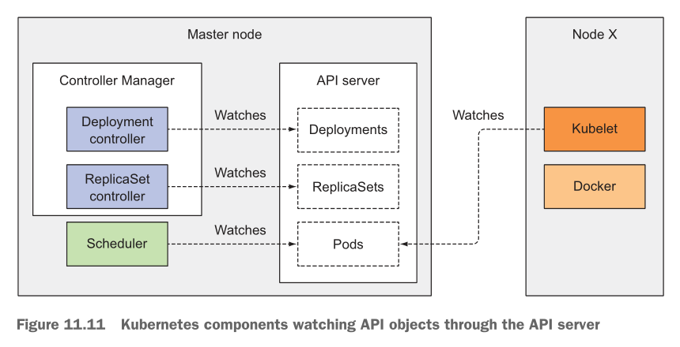
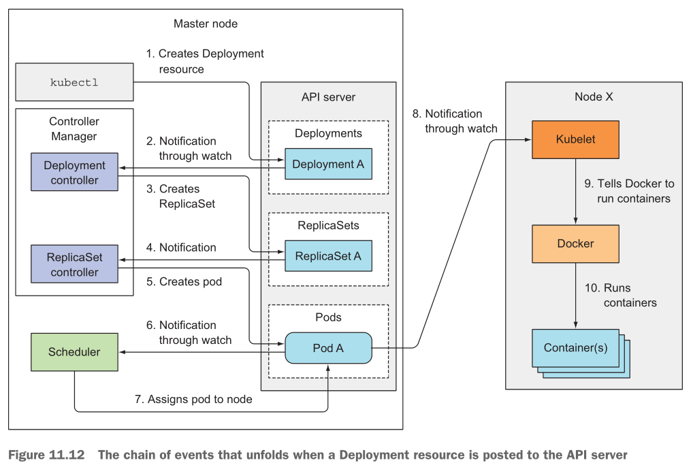
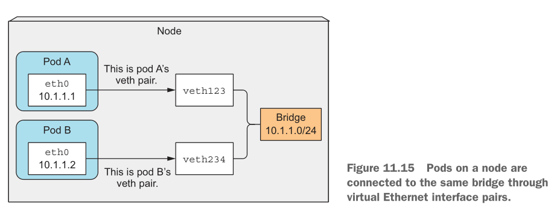
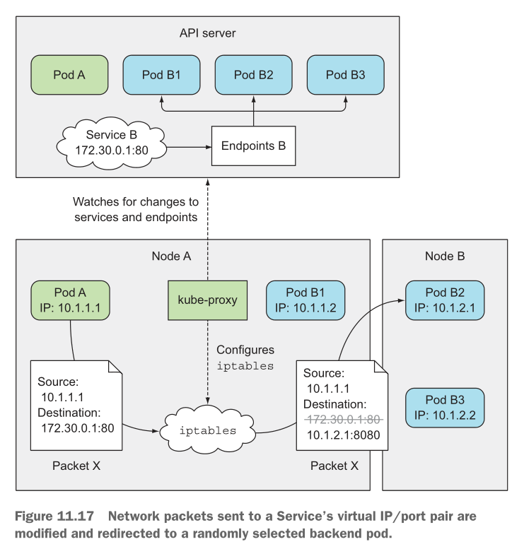
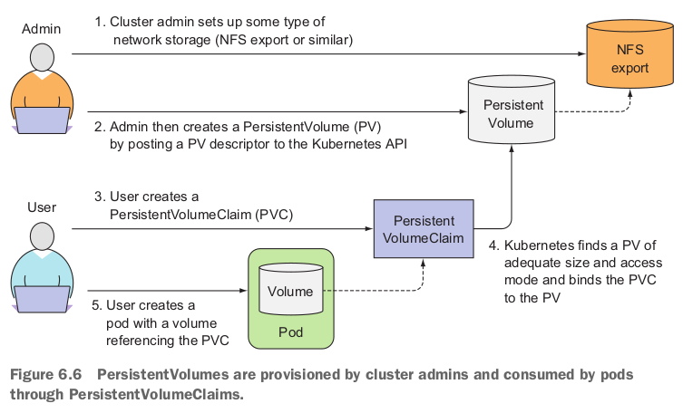
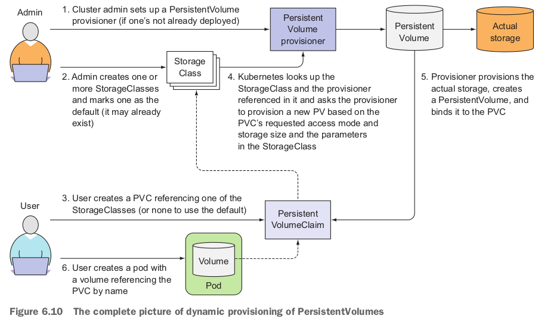
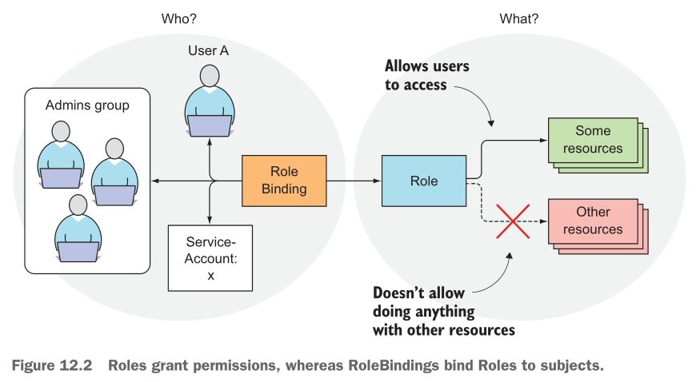
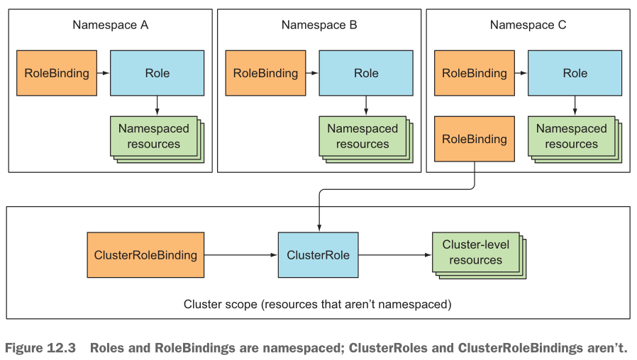
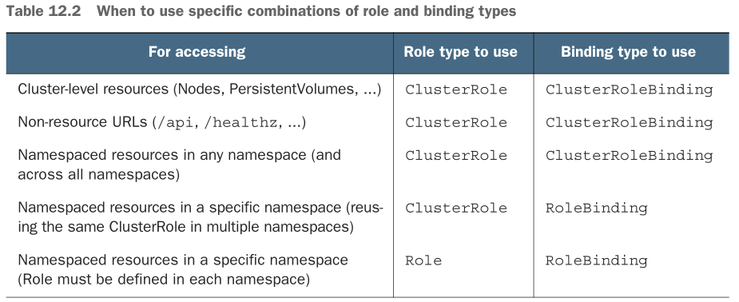

# Cheatsheet of core Kubernetes concepts

## Taxonomy of Kubernetes resources (a.k.a. components)
- `Pod`
- `ReplicationController`
- `ReplicaSet`
- `DaemonSet`
- `Job`
- `Endpoints`
- `Service`
- `Deployment`
- `Namespace`
- `PersistentVolume`
- `PersistentVolumeClaim`
- `StorageClass`
- `ConfigMap`
- `Secret`
  - `generic`
  - `tls`
- `List`
- Security
  - `Role`
  - `RoleBinding`
  - `ClusterRole`
  - `ClusterRoleBinding`
  - `PodSecurityPolicy` (The `PodSecurityPolicy` admission controller needs to be enabled.)
  - `NetworkPolicy`
- `LimitRange`
- `ResourceQuota`

## Kubernetes internals

### Architecture

#### Control Plane
- The `Control Plane` stores and manages the state of the cluster.
- Components
  - `etcd` distributed persistent storage
    - A fast, distributed, and consistent key-value store.
    - Uses an optimistic locking mechanism for concurrency control.
    - Uses RAFT for consensus.
  - The `API Server`
    - When a request wants to create, modify, or delete a resource, the
      request must go through `Admission Control`, which will update the
      missing fields in the request, modify fields as necessary, and
      perhaps reject the request.
    - `Admission Control` plugins include `ServiceAccount` (adding a default
      service account).
  - The `Scheduler`
    - Watches updates for any newly created `Pods`, and then modifies the `Pod`
      definition with which node it should run on. Then, the `Kubelets` will
      receive these updates and run `Pods` as necessary.
    - Two steps to scheduling: **filtering** to find acceptable nodes, then
      **prioritizing** the select the best node.
    - It is possible to use multiple different schedulers.
  - The `Controller Manager`
    - Ensures that the actual state of the system converges toward the desired
      state
    - Examples (not comprehensive):
      - ReplicaSet, DaemonSet, Job controllers
      - Deployment controller
      - StatefulSet controller
      - Node controller
      - Service controller
      - Endpoints controller
      - Namespace controller
      - PersistentVolume controller

#### Worker nodes
- Components (on each worker node)
  - The `Kubelet`
    - Responsible for everything running on a worker node.
      - Registering the node with the `API Server`
      - Watches the `API Server` and starts `Pod` containers.
      - Monitors running `Pods` and reports status.
      - Runs the readiness and liveness probes.
      - Terminates `Pods` when instructed.
  - The `Kubernetes Service Proxy` (aka `kube-proxy`)
  - The `Container Runtime` (e.g. Docker, rkt)

#### Add-on components
- The `Kubernetes DNS Server`
- The `Dashboard`
- An `Ingress Controller`
- `Heapster`
- The `Container Network Interface` network plugin

### How controllers cooperate: An example `Deployment`

### How Pods work
- `Pods` require an infrastructure container to hold all the shared namespaces
  between the containers, in particular the network.
- This infrastructure container is called `pause`.
- If this infrastructure container is killed, the `Pod` needs to be recreated.

### Inter-pod networking
- Kubernetes does not provide inter-pod networking functionality; this is
  provided by the `Container Network Interface` plugin.
- Kubernetes, however, mandates that this network ensure that no NAT occurs
  with inter-pod and inter-node communication.
- Questions: How does bridge networking work exactly? How are packets
  encapsulated and de-encapsulated with software defined networks?

### How `Services` work
- Everything related to `Services` is handled by the `kube-proxy`.
- The IP address used by a `Service` is virtual, and is never listed as the
  source or the destination in a network packet that leaves a node.

### Running highly available clusters
- Use **leader election** for non-horizontally scalable apps.

## `PersistentVolumes` and `PersistentVolumeClaims`

### Manual provisioning
Manual provisioning consists of creating `PersistentVolumes` manually, and then
creating `PersistentVolumeClaims` to bind volumes to `Pods`.

### Dynamic provisioning
Dynamic provision entails the dynamic creation of `PersistentVolumes` by
a provisioner as `PersistentVolumeClaims` are created. The
`PersistentVolumeClaims` reference a `StorageClass` in order to dictate what
type of `PersistentVolume` should be created.

## Securing Kubernetes

- `ServiceAccounts` are formatted as the following:
  - `system:serviceaccount:<namespace>:<service account name>`
- `Pods` can only use `ServiceAccounts` in the same `Namespace`.
- Groups are used to give permissions to sets of users and `ServiceAccounts`.
- Groups are simply strings.

### Built-in groups
- `system:unauthenticated`
- `system:authenticated`
- `system:serviceaccounts`
- `system:serviceaccounts:<namespace>`

### Enforcing mountable `Secrets`
- Give a `ServiceAccount` the annotation:
  - `kubernetes.io/enforce-mountable-secrets="true"`

### Role-based Access Control (RBAC)
- A subject is associated with one or more roles, each role dictating which
  verbs can be performed, and on which resources.
- RBAC authorization rules are configured through four resources
  - `Roles` (namespaced) and `ClusterRoles` (not namespaced), which specify
    which verbs can be performed on which resources.
  - `RoleBindings` and `ClusterRoleBindings`, which bind the above roles to
    specific users, groups or `ServiceAccounts`.

- `ClusterRoleBindings` must be used for non-namespaced resources, because even
  though normal `RoleBindings` can reference `ClusterRoles`, the normal
  `RoleBindings` cannot enable access for cluster-level resources.

### Linux namespaces
- A `Pod` generally has its own Linux namespace for networking and process, but
  can be instructed to share namespaces with its host (e.g. via the
  `spec.{hostNetwork|hostPID|hostIPC}` options).
- A `Pod` can share host ports using the `spec.containers[].ports[].hostPort`
  option, while maintaining a distinct network namespace from the host. This
  option is different from `NodePort` services that open a port on all nodes
  and forward to a randomly chosen `Pod`. `hostPort` simply forwards a port
  from the host to the container.

### Security Contexts
- Allows you to configure many security-related features, such as
  - Specify the user under which a process in containers will run
  - Prevent the container from running as root
  - Configure fine-grained privileges for each container
  - Set SELinux to lock down a container
  - Prevent the process from writing to the container's filesystem
- Proper security will require that Docker containers are built with security
  concepts in mind, such as correct user permissions (instead of `root` for
  everything).
- Instead of running containers as _privileged_, look up the Linux kernel
  capabilities and give the container access to only the capabilities is
  requires.
- Additionally, care should be taken so that the application does not write to
  disk in a way that Kubernetes cannot organize such disk files as mountable
  volumes. Being able to keep the container read only increases security
  posture.

## Resource limits
- Use the `Downward API` to pass CPU limit information to the container and use that to limit the number of CPUs and threads, because despite being in a container, processes within a container see the node's memory and CPU count.
  - `/sys/fs/cgroup/cpu/cpu.cfs_quota_us`
  - `/sys/fs/cgroup/cpu/cpu.cfs_period_us`

### Quality of Service levels
- `BestEffort`. no limits, no requests.
- `Guaranteed`. limits = requests.
- `Burstable`. requests < limits.
- Pods are killed according to the percentage of the resources used (pods
  with higher percentages are killed with higher priority).

### Setting resource minima, maxima, and defaults
- `LimitRange` resources can set minimum and maximum limits for individual
  pods and containers, as well as set default request sizes.

### Limiting _total resources_ available in a namespace
- `ResourceQuota`

## References
* All images are figures taken from Marko Luksa's book, **Kubernetes
  in Action**.
